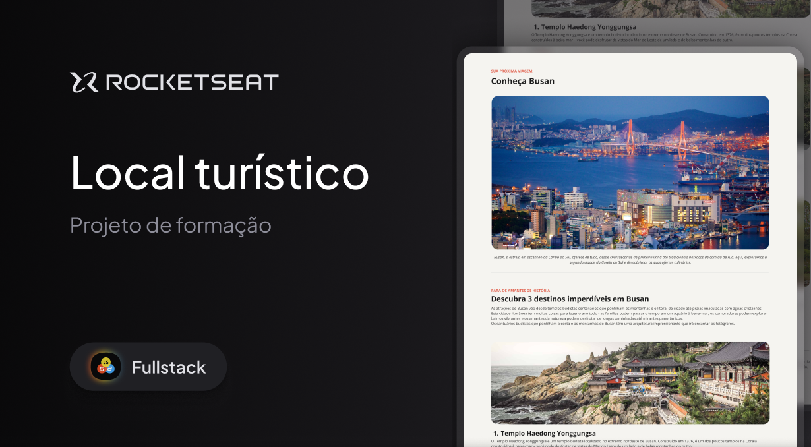

<h1 align="center"> Desafio Local turistico </h1>

O Primeiro desafio prático da trilha Full-Stack, promovido pela Rocketseat para ensino de tecnologias WEB.  

  <a href="#tecnologias">Tecnologias</a>&nbsp;&nbsp;&nbsp;|&nbsp;&nbsp;&nbsp;
  <a href="#projeto">Projeto</a>&nbsp;&nbsp;&nbsp;|&nbsp;&nbsp;&nbsp;
  <a href="#layout">Layout</a>&nbsp;&nbsp;&nbsp;|&nbsp;&nbsp;&nbsp;
  <a href="#licença">Licença</a>

  

 

  

## Tecnologias

- **HTML5** para estruturação do conteúdo
- **CSS3** para estilização
- **Google Fonts** para personalização da tipografia

## Projeto

- [Visita o projeto online!](https://rodrigocarrico01.github.io/SinglePage_Turistico/)

## Layout

Tu podes visualizar o layout do projeto através [DESTE LINK](https://www.figma.com/community/file/1384542229391733447/local-turistico). É necessário ter conta no [Figma](https://figma.com) para acedê-lo.

## Licença

Este projeto está sob a licença MIT.

---

